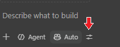

# Lab 3: Agent Mode - Verify the Product Snapshot

**Time:** 15 minutes  
**Outcome:** A corrected `workshop-output/product-snapshot.md`

## Why this matters

Copilot can create a polished document that still contains a wrong number or
unsupported conclusion. The analyst verifies the answer before sharing it.

## Step 1: Understand tools in plain language (3 min)

A **tool** lets Agent mode do one action, such as reading, searching, or editing
a file. For this lab, Copilot needs only workspace tools:

- Read the snapshot and sources.
- Search for evidence.
- Edit the snapshot.

No MCP server or external service is required.

## Step 2: Limit the allowed actions (3 min)

1. Open Copilot Chat and select **Agent** mode.
2. Open **Configure Tools**.

   

3. Keep only the workspace read, search, and edit tools needed for this task.
4. Do not enable terminal or external-service tools.

## Step 3: Run a small quality check (6 min)

Add `workshop-output/product-snapshot.md`, `starter-app/src`, and
`references/customer-request.md` as context. Ask:

```text
Review `workshop-output/product-snapshot.md` against the supplied code and
customer request.

Check only these five things:
1. The sample total is ₪126.
2. Each current rule cites a file and function.
3. Each requested outcome cites a TR ID.
4. Current behavior is not presented as requested behavior.
5. The original section and size limits are preserved.

Correct only `workshop-output/product-snapshot.md`. Do not add sections or
technical detail. End with a maximum five-bullet correction summary.
```

Watch one read action and one edit action. Confirm that both stay inside the
named files.

## Step 4: Verify one correction yourself (3 min)

Choose one corrected rule and open the cited function. Ask:

- Does the source contain the condition?
- Does the source contain the result?
- Did Copilot invent a reason?

## What good looks like

The snapshot is still short, the values are correct, and unsupported ideas are
open questions rather than confident statements.

## GitHub documentation

- [Asking GitHub Copilot questions in your IDE](https://docs.github.com/en/copilot/how-tos/chat-with-copilot/chat-in-ide)

## Continue

[Continue to Lab 4: Create One User Story](04-create-one-user-story.md)
